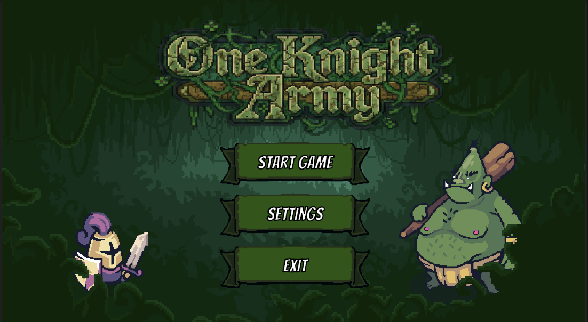
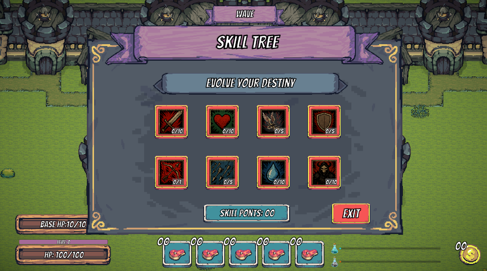
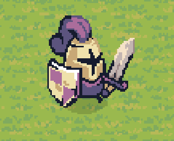

# 🛡️ One Knight Army

> **Szakdolgozati projekt** – Egy egyedi, top-down nézetű Tower Defense és Action-RPG hibrid.

## 📖 Összefoglaló

A **One Knight Army** egy feszült, felülnézetes (top-down) stratégiai játék, amelyben a megszokott Tower Defense mechanikák egyetlen hős irányításával egészülnek ki. A játékos **egy lovag szemszögéből** éli át az eseményeket, és a tornyok építése mellett közvetlenül is kiveszi a részét a harcból. 

A cél megvédeni a bázist a hullámokban támadó ellenségektől. A túléléshez elengedhetetlen a dinamikus védekezés, a karakter képességeinek fejlesztése, valamint az **NPC**-kkel való interakció és a **Küldetések (Questek)** teljesítése.

### ✨ Főbb Jellemzők:
* **Hibrid Játékmenet:** Tower defense alapok, valós idejű karakterirányítással fűszerezve.
* **Fejlődési Rendszer:** Részletes Képességfa (Skill Tree), ahol a játékos a saját játékstílusához igazíthatja a lovagját (pl. sebzés, életerő, pajzs, íjászat).
* **Pixel Art Látványvilág:** Egyedi, kidolgozott retro grafikai stílus.
* **Küldetésrendszer:** NPC-k és feladatok, amelyek tovább mélyítik a játékmenetet.

## 👥 Készítők

A projektet a következő hallgatók készítették:

* **Bangó Máté**
* **Bacskai Bence**
* **Juhász Márk Ferenc**

---

## 📸 Galéria

Íme néhány kép a játék jelenlegi állapotáról és látványvilágáról:

| Főmenü | Képességfa (Skill Tree) | A Lovag |
| :---: | :---: | :---: |
|  |  |  |